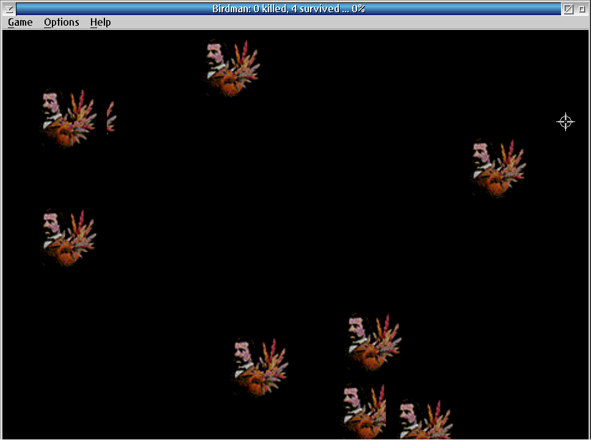

# Birdman for OS/2

Open Watcom port

Birds fly across the screen from right to left. Left-click to shoot them
before they escape. Double right-click kills all birds at once.



## Build

Requires Open Watcom 2.0 and OS/2 Toolkit 4.5.

```
compile-wat.cmd
```

Or manually:

```
wmake -f makefile.wat
```

Output: `bin\birdman.exe`

## Controls

| Key         | Action                    |
|-------------|---------------------------|
| Ctrl+N      | New Game                  |
| Ctrl+P      | Pause / Resume            |
| Ctrl+Q      | Quit Game                 |
| Ctrl+X      | Exit                      |
| Ctrl+B      | Background Run toggle     |
| Ctrl+F      | Frame Controls toggle     |
| Left click  | Shoot one bird            |
| Dbl R-click | Kill all birds            |

## Changes from Original (v0.01, 1998)

- Open Watcom build system
- Standard Game / Options / Help menu
- Six language support (EN, ES, NL, DE, FR, IT)
- Settings persistence
- Background Run and Frame Controls
- About dialog

## License

BSD 3-Clause — see `doc/LICENSE.txt`

## Authors

- Mike, Vienna — original 1998
- OS2World port — 2026

## Links

- https://www.os2world.com/games/index.php/native-games/other/227-birdman
